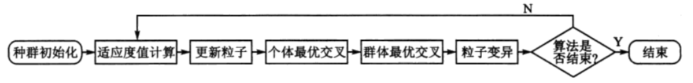

# 问题描述

TSP是最基本的路线问题，该问题寻求单一旅行者由起点出发，通过所有给定的需求点之后，最后再回到起点的最小路径成本，最早的旅行商问题的数学模型是由Dantzig等人提出。

# 算法流程

基于混合粒子群算法的TSP算法流程如图所示，

# 算法实现

1. 个体编码：整数编码
2. 适应度值：遍历路径的长度
$$
fitness(i) = \sum_{i,j=1}^npath_{i,j}
$$

3. 交叉操作：
4. 变异操作：

