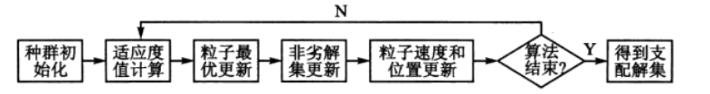

	# 理论基础
多目标优化问题是优化各个目标使其同时达到综合的最优值，但各个目标往往相互冲突，在满足其中一个目标最优的同时，其他的目标往往可能会受其影响而变得很差。

非劣解：在多目标优化问题的可行域中存在一个问题解，若不存在另一个可行解，使得一个解中的目标全部劣于该解，则该解称为多目标优化问题的非劣解。所有非劣解的集合叫做非劣解集。

三种方式
1. 求非劣解的生成法，包括加权法、约束法、加权法和约束法结合的混合法以及多目标遗传算法，即先求出大量的非劣解，构成非劣解的一个子集，然后按照决策者的意图找出最终解。
2. 交互法，主要为求解线性约束多目标优化的Geoffrion法，不先求出很多的非劣解，而是通过分析者与决策对话的方式，逐步求出最终解。
3. 事先要求决策者提供目标之间的相对重要程度，算法以此为依据，将多目标问题转化为单目标问题进行求解。

# 问题描述
五类物品，每类含有四种具体物品，现要求从这五种类别物品中分别选择一种物品放入背包中，使得背包内物品的总价值最大，总体积最小，并且背包的总质量不超过92kg。

数学模型为

$$
max \; P_x = \sum\limits_{i=1}^4P_i X\\
min \; R_x = \sum\limits_{i=1}^4R_i X\\
s.t.\; CX \le (92, 92, 92, 92)'
$$

其中，$P_x$表示背包内物品价值，$R_x$表示背包内物品体积，$C$表示物品质量，$X$为选择物品。

基于粒子群的二维多目标搜索算法流程如下

# 适应度计算
两个，价值和体积

# 筛选非劣解集
1. 初始筛选非劣解集
2. 更新非劣解集

# 粒子速度和位置更新

$$
V^{k+1} = wV^k+c_1r_1(P_{id}^k - X^k) + c_2r_2(P_{gd}^k - X^k)\\
X^{k+1} = X^k + V^{k+1}
$$

其中，$w$为惯性权重，$r_1$和 $r_2$为分布在$[0,1]$区间的随机数；$k$为当前迭代次数；$P_{id}^k$为个体最优粒子位置.

# 粒子最优
个体最优粒子

群体最优粒子
