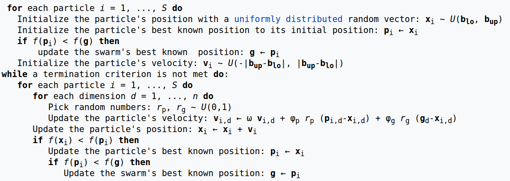

# PSO

## Introduction

**Particle swarm optimization (PSO)** is a computational method that optimizes a problem by iteratively trying to improve a candidate solution with regard to a given measure of quality. It solves a problem by having a population of candidate solutions, here dubbed particles, and moving these particles around in the search-space according to simple mathematical formulae over the particle's position and velocity. Each particle's movement is influenced by its local best known position, but is also guided toward the best known positions in the search-space, which are updated as better positions are found by other particles. This is expected to move the swarm toward the best solutions.

## Algorithm

A basic variant of the PSO algorithm works by having a **population (called a swarm)** of **candidate solutions (called particles)**. These particles are moved around in the search-space according to a few simple formulae. The movements of the particles are guided by their own best known position in the search-space as well as the entire swarm's best known position. When improved positions are being discovered these will then come to guide the movements of the swarm. The process is repeated and by doing so it is hoped, but not guaranteed, that a satisfactory solution will eventually be discovered.

Formally, let $f: R^n -> R$ be the cost function which must be minimized. The function takes a candidate solution as argument in the form of a vector of real numbers and produces a real number as output which indicates the objective function value of the given candidate solution. The gradient of $f$ is not known. The goal is to find a solution a for which $f(a) <= f(b)$ for all $b$ in the search-space, which would mean $a$ is the global minimum. Maximization can be performed by considering the function $h = -f$ instead.

Let $S$ be the number of particles in the swarm, each having a position $x_i \inR^n$ in the search-space and a velocity $v_i \in R^n$. Let $p_i$ be the best known position of particle $i$ and let $g$ be the best known position of the entire swarm. A basic PSO algorithm is then:

## References
1. [Wikipedia](https://en.wikipedia.org/wiki/Particle_swarm_optimization) 
2. MATLAB智能算法30个案例分析
3. [粒子群优化算法简介](http://www.cnblogs.com/hxsyl/p/4521778.html)
